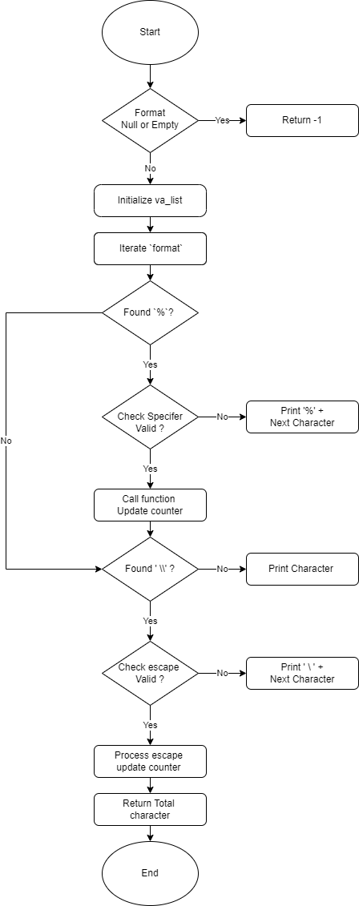

# _printf - *Custom Implementation of the printf Function*

## 🚀 Description

_printf is a custom implementation of the C standard library function printf. This project was built as part of an educational exercise to understand variadic functions, format specifiers, and output handling in C.

## 🛠️ Features

- Support for format specifiers: %c, %s, %d, %i, %%.
- Escape sequences such as \n, \t, and \\.
- Modular, clean, and maintainable implementation.
- Returns the number of characters printed (excluding the null byte).

## 📚 Usage

To use _printf in your C project:

1. Include the main.h header file.
2. Compile the code using GCC (see 📦 Compilation).

Prototype:

```c
int _printf(const char *format, ...);
```

## ✅ Examples

### Basic Usage

```c
_printf("Hello, World!\n");
// Output: Hello, World!
```

### Format Specifiers

```c
_printf("Character: %c\n", 'A');
// Output: Character: A

_printf("String: %s\n", "This is _printf");
// Output: String: This is _printf

_printf("Integer: %d\n", 123);
// Output: Integer: 123

_printf("Percent sign: %%\n");
// Output: Percent sign: %
```

### Escape Sequences

```c
_printf("Newline:\nTab:\tEnd\n");
`// Output:`
// Newline:
// Tab:    End
```

## 🔧 Supported Specifiers

| Specifier | Description                                   | Example                 |
|:----------|:----------------------------------------------|:------------------------|
| %c        | Prints a single character                     | _printf("%c", 'A');     |
| %s        | Prints a string of characters                 | _printf("%s", "Hello"); |
| %d        | Prints a signed decimal integer               | _printf("%d", -123);    |
| %i        | Prints a signed decimal integer (same as %d)  | _printf("%i", 456);     |
| %%        | Prints a literal % character                  | _printf("%%");          |

## 📂 Files

|  File                    |  Description                                                     |
|:-------------------------|:-----------------------------------------------------------------|
| main.h                   | Header file containing function prototypes and type definitions. |
| _printf.c                | Main function implementing the _printf logic.                    |
| handle_escape_sequence.c | Handles special escape sequences in the format string.           |
| print_numbers.c	         | Functions to handle numeric specifiers (%d, %i, %%).             |
| print_letter.c           | Functions to handle character and string specifiers (%c, %s).    |
| utils.c                  | Helper functions (_putchar, _strlen).                            |

## 📊 Logic Implementation

The following flowchart illustrates the internal logic of the `_printf` function:



## 📦 Compilation

To compile the project, use the following command:

```c
gcc -Wall -Werror -Wextra -pedantic -std=gnu89 *.c -o _printf
```

## ⚠️ Limitations

- Flags (+, -, 0, etc.) are not supported.
- Field width and precision are not implemented.
- Buffering is not handled like the standard library version.
- Only handles a subset of the standard printf functionality.

## 👨‍💻 Authors

- **Alexandre MORIN**  
  - [GitHub](https://github.com/alexandremorin24) | [Email](mailto:alexandre.morin24@gmail.com)

- **Haggui Razafimaitso**  
  - [GitHub](https://github.com/hagguishel) | [Email](mailto:hagguirzt@gmail.com)
