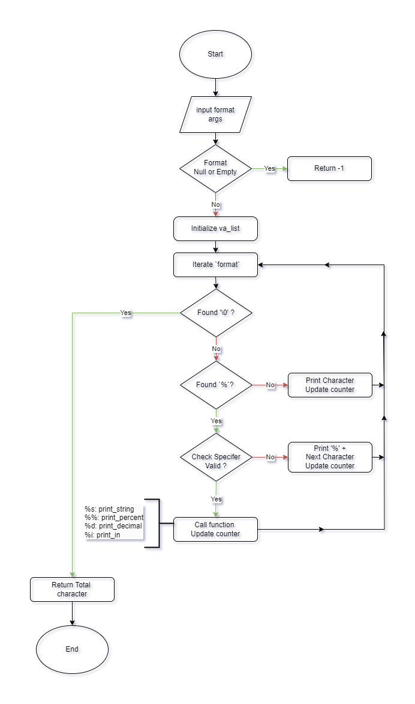

# _printf

## 🚀 Description

`_printf` is a custom implementation of the C standard library function `printf`.  
This project is part of the Holberton School curriculum and focuses on key C programming concepts such as:

- Variadic functions
- Format specifiers
- Handling output to the standard output (`stdout`)

The `_printf` function is designed to run in a **Linux environment** with **GCC** on **Ubuntu 20.04**.

## 🛠️ Requirements

- Ubuntu 20.04 LTS
- GCC compiler with the following flags:
  - `-Wall -Werror -Wextra -pedantic -std=gnu89`
- Git for version control
- Familiarity with C programming, variadic functions, and file handling.

## 📦 Compilation

To compile the project, ensure you have all required `.c` files in the same directory.  
Use the following command to generate the executable `_printf`:

```bash
gcc -Wall -Werror -Wextra -pedantic -std=gnu89 *.c -o _printf
```

## 🔧 Supported Specifiers

| Specifier | Description                                   | Example                 |
|:----------|:----------------------------------------------|:------------------------|
| %c        | Prints a single character                     | _printf("%c", 'A');     |
| %s        | Prints a string of characters                 | _printf("%s", "Hello"); |
| %d        | Prints a signed decimal integer               | _printf("%d", -123);    |
| %i        | Prints a signed decimal integer (same as %d)  | _printf("%i", 456);     |
| %%        | Prints a literal % character                  | _printf("%%");          |

## ✅ Examples

### Basic Usage

```c
_printf("Hello, World!\n");
// Output: Hello, World!
```

### Format Specifiers

```c
_printf("Character: %c\n", 'A');
// Output: Character: A

_printf("String: %s\n", "This is _printf");
// Output: String: This is _printf

_printf("Integer: %d\n", 123);
// Output: Integer: 123

_printf("Percent sign: %%\n");
// Output: Percent sign: %
```

## 📂 Files

|  File                    |  Description                                                     |
|:-------------------------|:-----------------------------------------------------------------|
| main.h                   | Header file containing function prototypes and type definitions. |
| _printf.c                | Main function implementing the _printf logic.                    |
| print_numbers.c	         | Functions to handle numeric specifiers (%d, %i, %%).             |
| print_letter.c           | Functions to handle character and string specifiers (%c, %s).    |
| utils.c                  | Helper functions (_putchar).                                     |
| man_3_printf             | Manual page describing the function and its usage.               |

## 📖 Man Page

A man page is available for the `_printf` function. To view it, run:

```bash
man ./man_3_printf
```

The man page includes:
- NAME
- SYNOPSIS
- DESCRIPTION
- USAGE EXAMPLES
- LIMITATIONS

## ✅ Testing

### Example Tests

Create a test file `main.c` to test the `_printf` function. Example:

```c
#include "main.h"

int main(void)
{
    _printf("Hello, World!\n");
    _printf("Number: %d\n", 42);
    return (0);
}
```

Compile and run the program:

```
gcc -Wall -Werror -Wextra -pedantic -std=gnu89 *.c -o test ./test
```

### Memory Leak Checks with Valgrind

Use Valgrind to ensure there are no memory leaks:

```
valgrind --leak-check=full --track-origins=yes ./_printf
```

Example Output:

```
==12345== HEAP SUMMARY: in use at exit: 0 bytes in 0 blocks total heap usage: 10 allocs, 10 frees ==12345== All heap blocks were freed -- no leaks are possible
```

## 🧩 Logic Implementation

The following flowchart illustrates the step-by-step logic of the `_printf` function.  
It shows how the function processes the input string, handles format specifiers, and prints the resulting output. It demonstrates the modular design of the function.




## ⚠️ Limitations

- Flags (+, -, 0, etc.) are not supported.
- Field width and precision are not implemented.
- Buffering is not handled like the standard library version.
- Only handles a subset of the standard printf functionality.

## 👨‍💻 Authors

- **Alexandre MORIN**  
  - [GitHub](https://github.com/alexandremorin24) | [Email](mailto:alexandre.morin24@gmail.com)

- **Haggui Razafimaitso**  
  - [GitHub](https://github.com/hagguishel) | [Email](mailto:hagguirzt@gmail.com)
